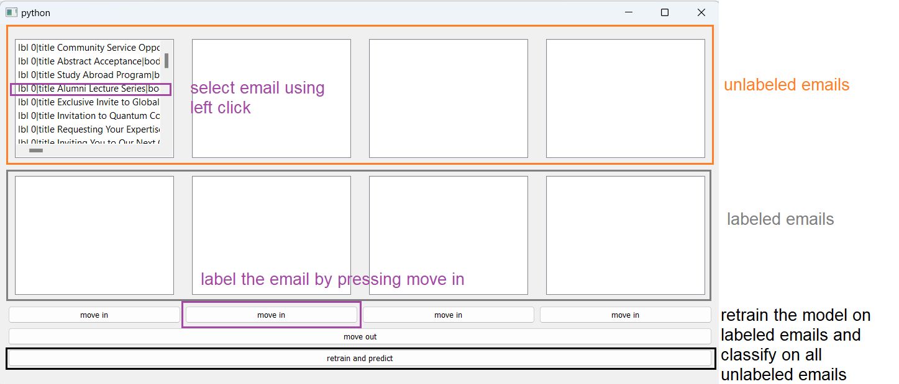

# CAT UI
A PyQt5 UI for manual text classification using BERTopic library

# Dependencies Installation
```commandline
pip install numpy pandas matplotlib PyQt5 bertopic openpyxl scikit-learn 
```

# How to Use

